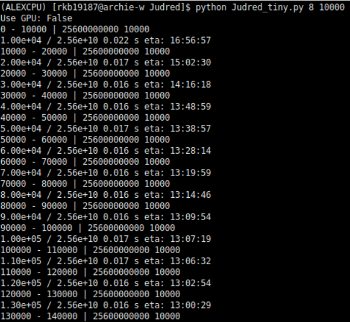

# Judred

Judred is a peptide specific molecular descriptor generator, it is loosely based on the [Mordred](https://github.com/mordred-descriptor/mordred) python package. The remit of this programme is to generate descriptors of peptides from only single-letter codes in order to provide a significantly faster method of generating descriptors for very large search spaces. It uses the HDF5 file format to store the data as this format is supported by many programming languages and platforms.


This programme is first used in the Journal of Chemical Theory and Computation article "Beyond tripeptides": https://doi.org/10.1021/acs.jctc.1c00159

## Example usage

Generate the full dataset of zwitterionic dipeptides:
```julia
julia judred.jl 2 
```

Generate the full dataset of zwitterionic tripeptides:
```julia
julia judred.jl 3
```

Generate the full dataset of zwitterionic tetrapeptides:
```julia
julia judred.jl 4 
```

etc.

## Example output

This image below shows example data (dipeptides) generated by the Judred programme.

The HDF5 database contain (left) a matrix of values contain the values of each descriptor for each peptide, a list of descriptor names (middle) and the list of peptides (right). These values can be recombined in for example a pandas DataFrame or the matrix of values used alone.


## Version 2

The unofficial version 2 (Judred_tiny.py) is written in Python and no longer uses the HDF5 file format. By removing the peptide labels and switching to the Apache Parquet format for data output we can reduce the dataset size by a factor of 13.

This can be done as the specific peptide to which the parameters represent can be calculated from the parameters position in the dataset.

Another improvement that has been made is the addition of GPU calculations. The arguments for the program are now:

```python
python Judred_tiny.py [peptide_length] [chunk_size]
python Judred_tiny.py 4 10000
```

Where the chunksize refers to how many values to calculate simulatneously (or as many as your processors will allow) - this in an important parameter particularly in the GPU computational as a lot of the 'processing' time is just moving data to and from the GPU so you want to set the chunck size to as large as your system will allow.

